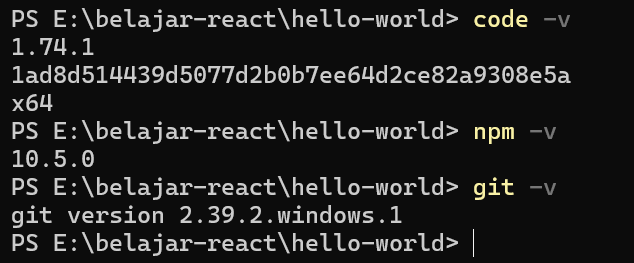
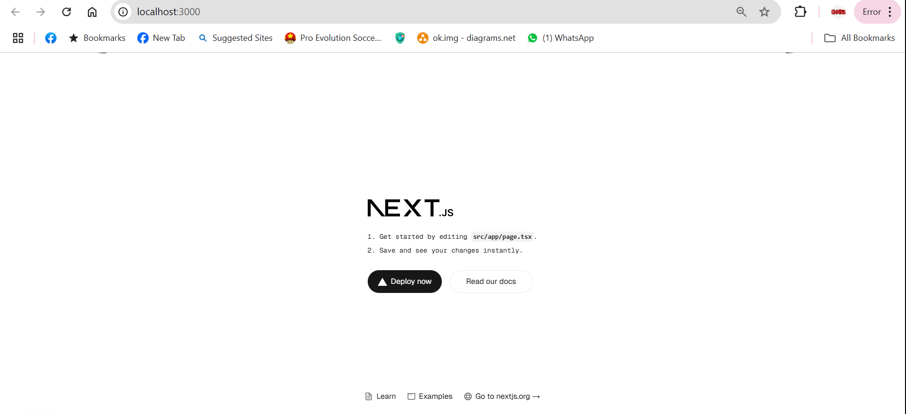
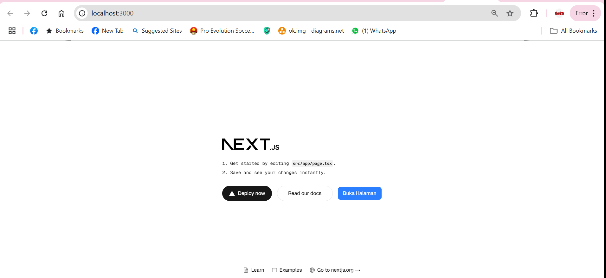
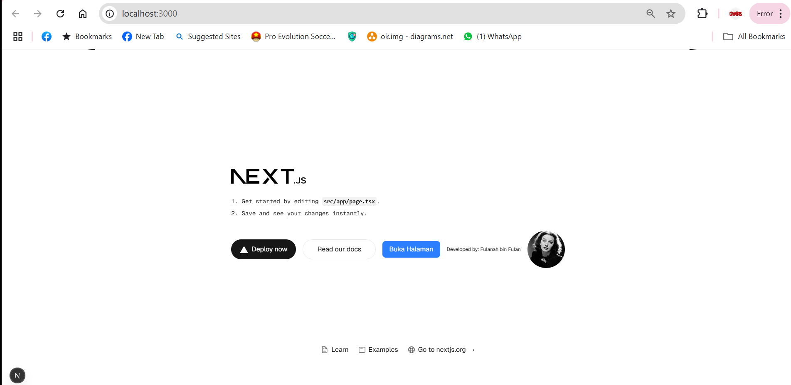

*Praktikum 1*

Menginstall kebutuhan praktikum

Fungsi utama 

Git: Melacak perubahan kode, bekerja dalam tim, version control

VsCode : Editor kode ringan dengan banyak fitur dan integrasi

Node.js : Menjalankan JavaScript di server, membangun aplikasi web

*Praktikum 2*

Penjelasan istilah-istilah:

TypeScript → Superset JavaScript dengan static typing.

ESLint → Linter untuk menjaga kualitas kode.

Tailwind CSS → Framework CSS utility-first.

App Router → Sistem routing baru di Next.js (app/).

Import Alias → Memudahkan import file dengan path pendek.

Turbopack → Bundler baru yang super cepat untuk Next.js.

Penjelasan kegunaan file dan folder di dalam struktur react

app/ → Folder utama untuk halaman & API (App Router).

components/ → Tempat menyimpan komponen UI yang bisa digunakan ulang.

styles/ → Tempat file CSS global atau Tailwind.

public/ → Tempat menyimpan gambar dan aset statis.

tsconfig.json → Konfigurasi TypeScript (jika pakai TS).

next.config.js → Konfigurasi Next.js, misalnya setting optimasi.

package.json → Daftar dependencies dan perintah npm.

README.md → Dokumentasi proyek.

*Praktikum 3*

*Praktikum 4*

Sintaks user.imageUrl digunakan untuk mengakses properti imageUrl dari objek user, user.imageUrl mengambil URL gambar dari objek user, sehingga bisa digunakan dalam atribut src pada elemen img.

